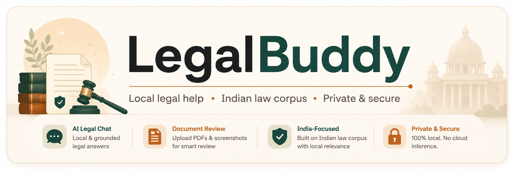

<p align="center">
  
</p>

<h1 align="center">Legal Buddy</h1>

<p align="center">
  <strong>Local-first Indian legal assistant powered by Gemma 4 and Ollama</strong><br />
  Ask legal questions in plain language and review contracts, privacy policies, and terms before you sign.
</p>

<p align="center">
  <a href="https://ai.google.dev/gemma"></a>
  <a href="https://ollama.com"></a>
  <a href="https://fastapi.tiangolo.com"></a>
  <a href="https://www.python.org"></a>
  <a href="https://github.com/facebookresearch/faiss"></a>
  <a href="https://ai.google.dev/gemma/docs"></a>
</p>

<p align="center">
  
  
  
  
</p>

<p align="center">
  <a href="#overview">Overview</a> ·
  <a href="#features">Features</a> ·
  <a href="#quick-start">Quick Start</a> ·
  <a href="#configuration">Configuration</a> ·
  <a href="#api-endpoints">API</a> ·
  <a href="#demo-flow">Demo</a>
</p>

---

## Overview

Legal Buddy is split into a lightweight frontend and a FastAPI backend:

| Layer | Role |
| --- | --- |
| `frontend/` | Multi-page UI for chat, document scanning, and project info |
| `backend/` | API, Ollama integration, PDF/image pipeline, and Indian-law retrieval |

When you start the backend, it also serves the frontend on the same port, so you usually only need one command to run the app.

---

## Features

| Feature | What it does |
| --- | --- |
| **Legal chat** | Ask about rights, consumer issues, employment, tenancy, contracts, and more — grounded in a bundled Indian-law corpus |
| **Document scanner** | Upload PDFs or screenshots of terms, privacy policies, or contracts for risk review |
| **Multimodal review** | PDFs are converted to page images so Gemma can inspect layout-heavy documents, not just extracted text |
| **Local inference** | Gemma runs through Ollama on `http://127.0.0.1:11434`, keeping sensitive uploads on your machine |
| **Plain-language answers** | Chat replies are readable plain text, without internal retrieval labels shown to users |

---

## Why `gemma4:e2b`

`gemma4:e2b` is a practical fit for a privacy-sensitive legal product:

- Strong enough for legal Q&A and clause review
- Supports multimodal document analysis from page images
- Runs locally through Ollama without cloud inference
- Easy to demo in a hackathon setting

---

## Project structure

```text
legal-buddy/
├── logo/
│   └── legal_buddy.png           # Project banner
├── frontend/
│   ├── index.html                # Landing page + backend health
│   ├── pages/
│   │   ├── chat.html             # Legal Q&A
│   │   ├── documents.html        # Upload & review documents
│   │   ├── draft.html            # Draft legal documents
│   │   ├── scanner.html          # Redirects to documents.html
│   │   └── about.html            # Project overview
│   └── assets/
│       ├── chat.js
│       ├── documents.js
│       ├── draft-page.js
│       ├── markdown-render.js
│       ├── config.js
│       └── styles.css
├── backend/
│   ├── main.py                   # FastAPI app + static frontend mount
│   ├── settings.py
│   ├── services/
│   │   ├── ollama_service.py     # Chat, RAG, document analysis
│   │   └── ocr_service.py        # PDF/image extraction
│   └── scripts/
│       └── build_legal_rag.py    # Rebuild FAISS index
├── legal_faiss.index             # Vector index (bundled corpus)
├── legal_texts.npy               # Corpus text chunks
└── legal_metadata.json           # Source labels and citations
```

---

## Quick start

### Prerequisites

- Python 3.10+
- [Ollama](https://ollama.com) installed and running
- The `gemma4:e2b` model pulled locally

### 1. Install dependencies

```powershell
cd backend
python -m venv venv
.\venv\Scripts\Activate.ps1
pip install -r requirements.txt
```

### 2. Configure environment

```powershell
Copy-Item .env.example .env
```

Default values in `backend/.env.example` are enough for a local run.

### 3. Pull the model

```powershell
ollama pull gemma4:e2b
```

Optional, for semantic retrieval with the bundled index:

```powershell
ollama pull nomic-embed-text
```

### 4. Start the app

From the project root:

```powershell
uvicorn backend.main:app --host 127.0.0.1 --port 4000
```

Open:

```text
http://127.0.0.1:4000
```

The backend serves both the API and the frontend. On startup, it can also open the browser automatically.

---

## Optional: separate frontend server

If you prefer serving the frontend separately during development:

```powershell
cd frontend
python -m http.server 5500
```

Then open `http://127.0.0.1:5500`. The frontend calls the backend at `http://127.0.0.1:4000` via `frontend/assets/config.js`.

---

## Configuration

Key settings in `backend/.env`:

| Variable | Default | Purpose |
| --- | --- | --- |
| `PORT` | `4000` | API and frontend port |
| `OLLAMA_BASE_URL` | `http://127.0.0.1:11434` | Local Ollama endpoint |
| `OLLAMA_CHAT_MODEL` | `gemma4:e2b` | Chat and document analysis model |
| `OLLAMA_EMBED_MODEL` | `nomic-embed-text` | Optional query embeddings |
| `EMBEDDING_PROVIDER` | `ollama` | `ollama` or `huggingface` |
| `HF_EMBED_MODEL` | empty | Hugging Face embedding model |
| `LEGAL_CONTEXT_TOP_K` | `4` | Number of RAG passages per chat turn |
| `MAX_PDF_PAGES` | `8` | Max PDF pages analyzed per upload |
| `MAX_TEXT_CHARS` | `16000` | Max extracted text sent to the model |

---

## Rebuilding the legal RAG index

The builder script creates three aligned files at the project root:

- `legal_faiss.index`
- `legal_texts.npy`
- `legal_metadata.json`

**Sources** (downloaded when you run the builder — not required for normal app use)

- Constitution JSON (pass via `--constitution-json`)
- Hugging Face dataset `Hrutik2003/Bns_Law_Rag_DB`

### With Hugging Face embeddings

```powershell
$env:EMBEDDING_PROVIDER="huggingface"
$env:HF_EMBED_MODEL="BAAI/bge-large-en-v1.5"
backend\venv\Scripts\pip.exe install -r backend\requirements.txt
backend\venv\Scripts\python.exe backend\scripts\build_legal_rag.py
```

### With Ollama embeddings

```powershell
ollama pull nomic-embed-text
$env:EMBEDDING_PROVIDER="ollama"
$env:OLLAMA_EMBED_MODEL="nomic-embed-text"
backend\venv\Scripts\python.exe backend\scripts\build_legal_rag.py --embedding-provider ollama
```

If no matching embedding model is configured, the backend falls back to keyword retrieval over the same corpus.

---

## API endpoints

| Method | Endpoint | Description |
| --- | --- | --- |
| `GET` | `/api/health` | Backend and Ollama status |
| `POST` | `/api/chat` | Legal Q&A with corpus grounding |
| `POST` | `/api/scan` | PDF/image document review |

---

## Pages

| Page | Path | Description |
| --- | --- | --- |
| Home | `/index.html` | Intro and backend health |
| Chat | `/pages/chat.html` | Grounded legal Q&A |
| Documents | `/pages/documents.html` | Full PDF review + Q&A on your file |
| Draft | `/pages/draft.html` | Generate legal document drafts |
| About | `/pages/about.html` | Hackathon story and demo flow |

---

## Demo flow

1. Ask a grounded legal question about tenancy, fraud, salary withholding, or consumer rights.
2. Upload a privacy policy PDF or screenshot-heavy terms page and review flagged clauses.
3. Explain that inference stays local through Ollama and the Indian legal corpus improves relevance.

---

## Notes

- The app is local-first at the model layer.
- The bundled FAISS index uses 1536-dimensional embeddings. Use a matching local embedding model for semantic retrieval, or rely on keyword fallback.
- Legal Buddy provides general legal information, not formal legal advice.

---

<p align="center">
  <sub>Built for the Build With Gemma 4 hackathon · Local inference · Indian law corpus · Privacy-first document review</sub>
</p>
